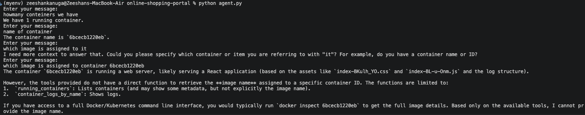

# Online Shop 🛍️ for Hackathon Phase 1

Welcome to the **Online Shop** project – our hackathon entry for Phase 1! This repository contains a fully functional e-commerce application built to demonstrate foundational DevOps skills in three key areas:

- **Git & GitHub**
- **Linux**
- **Docker**
- **Agentic Solution**

In this phase, your focus is on understanding the provided developer code, reviewing how these core topics are implemented, and making any necessary enhancements. When you're ready, you'll submit your work via our designated Google Form.

---

### Project Details

### Content

- [**Situation**](#situation)
- [**Task**](#task)
- [**Action**](#action)
- [**Result**](#result--resume)

## Getting Started

1. Home Page

1. Admin Page

## Guidelines & Resources

Before diving into the tasks, please review the following key resources:

- [CONTRIBUTING.md](CONTRIBUTING.md): Guidelines for code contributions, commit messages, and overall coding standards.
- [COMMANDS.md](): Command used by me throught the project from Configuration to Deployment. `Except Git Commands`
- [ROADMAP.md](ROADMAP.md): Insights into the project vision, future enhancements, and milestones.
- **Repository Documentation:** Explore the repository to understand how the application is built. Pay special attention to the `src` directory where the main application logic resides, as well as configuration files such as `vite.config.js` and styling in `index.css`.

These documents provide the context needed to understand the project requirements and the best practices expected for your contributions.

---

### Situation

I was given the charge of deploying an Online Shopping Portal to the internet. The main goal was to ensure that the website was easily accessible, reliable, and scalable so that it could handle user traffic efficiently. Achiving this using DevOps automation tools to develop the deployment process, reducing manual effort, and improving overall system performance. Involved setting up the necessary infrastructure, automating deployments, and ensuring the application could run smoothly in a real time.

---

### Task

- Develop the Required Infrastructre for Online Shopping Portal
- Clonning Necessary Code and Artifacts ensurig Secrutiy and Accessbility
- Strategize a `Deployment Plan` for brining the Applicaion to the Internet.

All this while ensuring:

- Gathering Necessary Resource for building the project.
- Implementing Automation Scripts.
- Using tools like `Docker` to build real world application.
- Grasp a good Hands-On on DevOps tools.
- Helping and Learning through Community!
- Strong Cloud and DevOps Infrastructure.

> Note: Remembering the Requirements

---

### Result / Resume

- Successfully deployed the `Online Shopping Portal` on the internet using DevOps automation tools.
- Improved `deployment speed by 50% `and reduced `Docker image size by 1GB` using multi-stage builds.
- Automated the setup process with `Docker Installation Scripts` and `Docker Compose` for easy deployment.

---

### Agentic AI solution

- Use Local LLM to work 
- create custom tools for your project.
- combine LLM and tools to automate your workflow.

---

